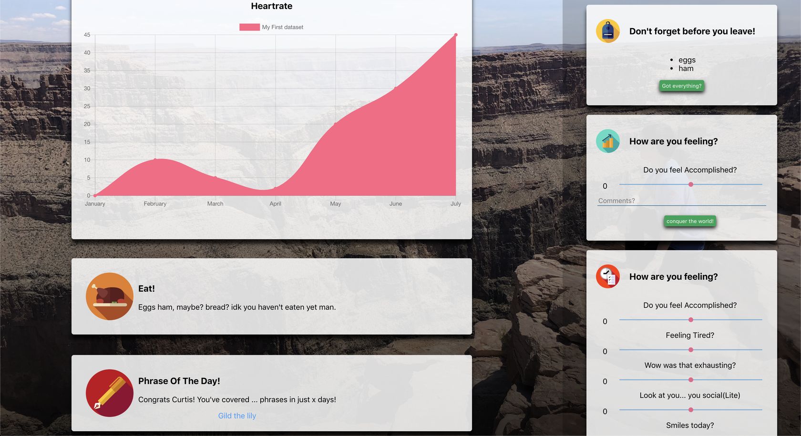

# Lizzie News

  

I've always had ideas that needed some sort of notification delivery service. 

Notifications are important because sometimes you need reminders to exercise or reminders to be the first to profit off high-scoring Kaggle kernels.

It wasn't until I started making Lizzie (my biometrics tracker) did I seriously need to dashboard information nicely. So there it hit me, I'll make a newsfeed for my life.

Everything from items to choose for my backpack, to reminders to eat (sometimes I study until 2 and realize that I can't solve problems because I didn't eat yet) will be on LNews. From my current curves of forgetting, to my heart rate in the last hour, LNews will be the dashboard for all things Lizzie.

Here are some of my favourite planned "cards":

- A scrapper that shows me any UW Reddit post that makes over 1000 upvotes (pls don't kill me but I don't Reddit :/)
 - Sleep analysis
 - Accomplishment cards: 4 years ago today (Things learned on Lizzie Peaks)
 - A pie chart showing the daily activities I participated in today
 - Random Todoist cards that have been backlogged without love
 - How calendar events (and in extension the........ special profs in my life) affect my mood
 - Congratulation cards for when I use new words that I've learned in FB messenger

Ultimately I want Lizzie News to be built to a point where it'll impact the decisions I make in my life. For example, if going to calc raises my cortisol levels by 20% I might stay back and catch up on work instead. This also means that LNews will open on every new chrome tab I create, so that it never becomes out of mind.

### Images Credit
I'm pretty sure that most of the icons were found on https://www.flaticon.com/. I'm sorry but I think I lost all of the individual links to each icon a while ago so I cannot give credit to the authors of the images used here.
